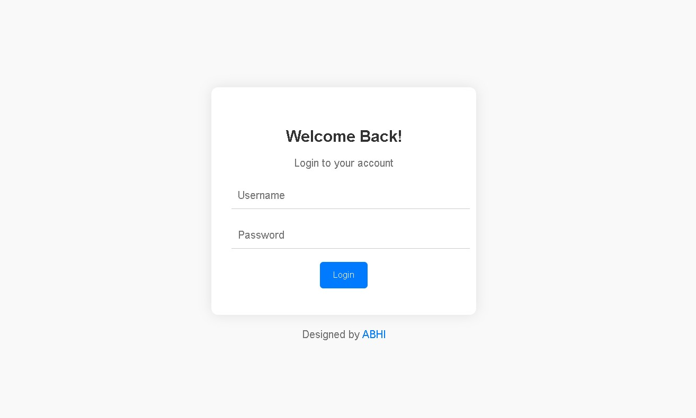

# Animated Login Page

This project demonstrates a stylish animated login page created using HTML, CSS, and JavaScript. The login page features input field animations, form validation.

## Features

- Modern and visually appealing design.
- Input field label animations.
- Form validation with alerts for empty fields.

## Getting Started

1. Clone or download this repository.
2. Open the `index.html` file in a web browser to see the animated login page.

## Usage

1. Enter your username and password in the respective input fields.
2. Click the "Login" button.
3. If either field is empty, an alert will prompt you to fill both fields.
4. Upon successful login (simulated), an alert will notify you of the success.

## Customization

- Modify the `styles.css` file to change colors, fonts, or any other visual aspects.
- Implement actual authentication logic in the `validateForm` function in `script.js` as needed.

## Credits

Designed by [ABHI](https://abhi.fun).

## Contributors Are Welcome

Contributions are welcome! If you'd like to enhance the login page's functionality, add new features, or improve the design, feel free to fork this repository and submit your pull requests. Let's make this login page even better together.

## License

This project is licensed under the [MIT License](LICENSE).
